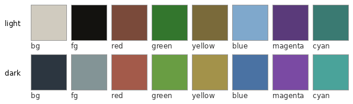
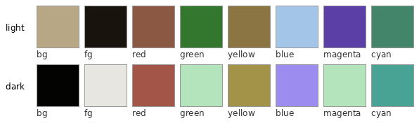
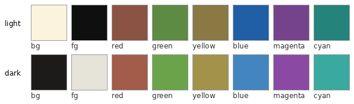
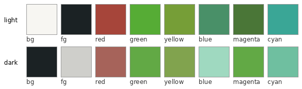
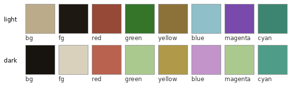

# dotfiles

Personal config, plain files + symlinks. No install framework, no templating

## Layout

```
config/    -> $XDG_CONFIG_HOME (~/.config)
home/      -> $HOME (files that must live outside XDG, e.g. bashrc-stub)
bin/       -> anywhere on PATH (~/.local/bin)
```

Bash itself doesn't know about XDG paths, so `home/bashrc-stub` is the
one real `~/.bashrc` -- it just sets `XDG_CONFIG_HOME` and sources the
actual config at `config/bash/bashrc`.

## Setup

Symlink what you want, e.g.:

```sh
ln -s "$PWD/home/bashrc-stub" ~/.bashrc
ln -s "$PWD/config/bash" ~/.config/bash
ln -s "$PWD/config/tmux" ~/.config/tmux
ln -s "$PWD/config/alacritty" ~/.config/alacritty   # Linux/WSL path;
                                                     # on Windows this
                                                     # goes in
                                                     # %appdata%/alacritty
ln -s "$PWD/bin/alacritty-theme.sh" ~/.local/bin/alacritty-theme.sh
```

Windows PowerShell profile (dynamic window title, same idea as the bash
one) -- run from PowerShell, `$PROFILE` resolves to the right path for
whichever PowerShell version is installed:

```powershell
New-Item -ItemType SymbolicLink -Path $PROFILE -Target "$PWD\home\Microsoft.PowerShell_profile.ps1" -Force
```

## Alacritty themes

`config/alacritty/themes/` bundles the full
[alacritty-theme](https://github.com/alacritty/alacritty-theme)
community pack plus 10 custom family themes (`slate_*`, `bonepaper_*`,
`flexoki_*`, `martin_*`, `cypress_*`) sourced from
[devs-themes](https://github.com/devinscodex/devs-themes), the
canonical palette repo shared with Slate/Runestone/webUI.

`bin/alacritty-theme.sh <name>` switches the active theme (partial
name match, e.g. `alacritty-theme.sh osaka`) and keeps tmux's
active-tab color in sync in every running session -- one command
instead of hand-editing `alacritty.toml`'s import line and separately
re-running a matching `tmux set -g`.

### Custom family themes

bg/fg + the 6 real ANSI colors, light and dark. Generated by
`make_swatches.py` -- re-run after editing any `<family>_{light,dark}.toml`.

| Slate | Bonepaper |
|---|---|
|  |  |

| Flexoki | Martin |
|---|---|
|  |  |

| Cypress |
|---|
|  |

## tmux

`config/tmux/tmux.conf` -- vi-style pane binds, true-color enabled,
theme-aware active/inactive pane and tab colors (see the file's own
comments for the per-color rationale).
